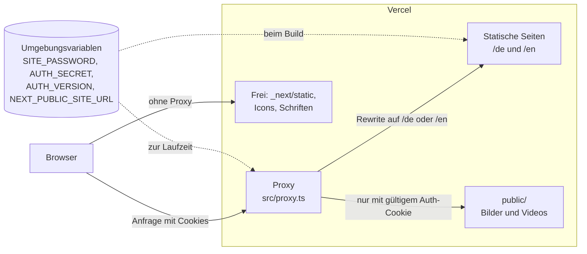

# Architektur

Kurzer Überblick, wie eine Anfrage verarbeitet wird und wo was liegt. Setup und Befehle stehen im [README](../../README.md).

## Kontext

## Ablauf einer Anfrage

1. **Proxy.** Jede Anfrage außer `_next/static`, `favicon.ico`, `robots.txt`, `Icons/` und `fonts/` läuft zuerst durch `src/proxy.ts` (Node.js-Runtime auf Vercel).
2. **Passwortschutz.** Der Proxy prüft den Cookie `site-auth`: ein HMAC-Token aus `SITE_PASSWORD`, `AUTH_SECRET` und `AUTH_VERSION` (`src/lib/auth.ts`). Ohne gültigen Cookie folgt ein Redirect auf `/login`; ein korrekter `?key=` setzt den Cookie und leitet auf die URL ohne `key` weiter. Ohne `SITE_PASSWORD` entfällt die Prüfung (lokale Entwicklung).
3. **Sprache.** Für Seitenpfade (`/`, `/projects…`, `/login`) wählt der Proxy die Sprache aus dem Cookie `lang`, sonst aus `Accept-Language`, und schreibt intern auf `/de/…` oder `/en/…` um. Die sichtbare URL bleibt gleich; ein direkt aufgerufenes `/de/…` wird auf den Pfad ohne Präfix umgeleitet.
4. **Seite.** Die Seiten unter `src/app/[lang]/` sind beim Build je Sprache vorgerendert (`generateStaticParams`) und werden statisch ausgeliefert.
5. **Medien.** Bilder und Videos kommen direkt aus `public/` (`images.unoptimized`, keine Bildoptimierung zur Laufzeit), aber erst nach der Passwortprüfung.

Jede Antwort trägt die Security-Header aus `src/lib/security-headers.ts`, eingebunden in `next.config.ts`.

## Statisch und dynamisch

- **Statisch:** alle Seiten in beiden Sprachen, die Projektdetail- und Demo-Seiten eingeschlossen.
- **Dynamisch:** der Proxy bei jeder Anfrage und die Server-Action des Login-Formulars (`src/app/[lang]/login/actions.ts`), die das Passwort prüft und den Cookie setzt.
- **Im Browser:** der Sprachumschalter schreibt den Cookie `lang` und lädt die Seite neu vom Server.

## Umgebungsvariablen

| Variable               | Gelesen von             | Zweck                                       |
| ---------------------- | ----------------------- | ------------------------------------------- |
| `SITE_PASSWORD`        | Proxy, Login (Laufzeit) | Passwort; ohne Wert ist der Schutz aus      |
| `AUTH_SECRET`          | Proxy, Login (Laufzeit) | Schlüssel für die Signatur des Auth-Cookies |
| `AUTH_VERSION`         | Proxy, Login (Laufzeit) | erhöhen, um alle Besucher auszuloggen       |
| `NEXT_PUBLIC_SITE_URL` | Layout (Build)          | Basis-URL des Open-Graph-Bilds              |

## Wo was liegt

- **UI-Texte:** `src/i18n/de.ts` und `src/i18n/en.ts`; Sprachcodes und Cookie in `src/i18n/lang.ts`.
- **Inhalte:** Projekte in `src/data/` (je Sprache Haupt- und weitere Projekte, gemeinsamer Typ in `types.ts`), Skills in `skills.json` und `skills_en.json`, Bildgrößen in `image-sizes.ts`.
- **Design-Tokens:** Farben und Animationen im `@theme` von `src/app/globals.css`; Tailwind erzeugt daraus die Utility-Klassen. `src/lib/theme.ts` stellt die Tokens für SVG- und Canvas-Code bereit.
- **Medien:** `public/Bilder/`, `public/Videos/` (hinter dem Passwort), `public/Icons/` und `public/fonts/` (frei).
